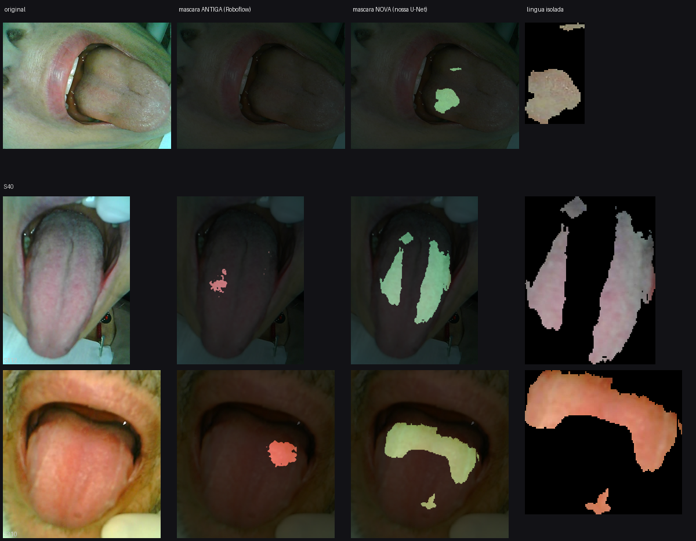

# Hality — como o sistema funciona

Visão geral das etapas, do que entra em cada uma e do porquê de cada decisão.
Para o contrato dos módulos, ver `ARQUITETURA.md`.

---

## O caminho de uma foto

```
                    ┌─────────────────────────────────────────┐
   foto do usuário  │  bytes: JPEG, PNG, BMP ou HEIC          │
                    └───────────────────┬─────────────────────┘
                                        ▼
        ┌───────────────────────────────────────────────┐
   1    │ NORMALIZAÇÃO                                  │
        │ decodifica, corrige rotação EXIF,             │
        │ reamostra preservando proporção               │
        └───────────────────┬───────────────────────────┘
                            ▼
        ┌───────────────────────────────────────────────┐      ✗ "foto muito escura"
   2    │ FILTRO 1 — QUALIDADE DA IMAGEM ───────────────┼───▶  ✗ "foto muito clara"
        │ exposição e nitidez. Dois números, sem modelo │      ✗ "foto tremida"
        └───────────────────┬───────────────────────────┘
                            ▼
        ┌───────────────────────────────────────────────┐
   3    │ FILTRO 2 — GATE DE LÍNGUA (Modelo A) ─────────┼───▶  ✗ "não identifiquei
        │ DINOv2 + regressão logística                  │          uma língua"
        └───────────────────┬───────────────────────────┘
                            ▼
        ┌───────────────────────────────────────────────┐
   4    │ SEGMENTAÇÃO E ISOLAMENTO                      │
        │ U-Net própria → máscara da língua             │
        └───────────────────┬───────────────────────────┘
                            ▼
        ┌───────────────────────────────────────────────┐      ✗ "aproxime a câmera"
   5    │ FILTRO 3 — SANIDADE DA MÁSCARA ───────────────┼───▶  ✗ "não consegui
        │ área mínima e fragmentação                    │          delimitar a língua"
        └───────────────────┬───────────────────────────┘
                            ▼
        ┌───────────────────────────────────────────────┐
   6    │ EXTRAÇÃO DE CARACTERÍSTICAS                   │
        │ 34 medidas, só dentro da máscara              │
        └───────────────────┬───────────────────────────┘
                            ▼
        ┌───────────────────────────────────────────────┐
   7    │ CLASSIFICADOR (Modelo B)                      │
        │ gradient boosting → probabilidade calibrada   │
        └───────────────────┬───────────────────────────┘
                            ▼
        ┌───────────────────────────────────────────────┐
   8    │ DECISÃO COM ABSTENÇÃO                         │
        └───┬──────────────┬────────────────┬───────────┘
            ▼              ▼                ▼
        "indício"    "sem indício"   "inconclusivo"
```

Quatro saídas por rejeição antes de qualquer estimativa, mais a abstenção no fim.
**Rejeitar é resposta bem-sucedida do sistema**, não erro — e sempre com um motivo
específico, porque "foto tremida" resolve o problema do usuário e "erro" não.

---

## O que entra: as imagens e o rótulo

**Nossas imagens.** 323 fotos vindas de uma clínica parceira na PUCRS, casadas com uma
tabela de anamnese que traz uma nota clínica de 1 a 3 por paciente. São fotos de boca
em close, com a língua exposta, tiradas por celular em contexto de consultório.

**O rótulo.** A nota de 1 a 3 é o alvo do treino. Verificamos que ela não é derivável do
questionário: uma árvore de decisão sem limite de profundidade, autorizada a memorizar
o conjunto inteiro, chega a apenas 81,7% usando as respostas — e existem 31 padrões de
resposta idênticos com nota diferente. Há informação externa, consistente com avaliação
humana.

**Como classificamos o que é e o que não é halitose.** Nós não definimos isso. A clínica
definiu, e o modelo aprende a reproduzir a nota dela. Em aprendizado supervisionado não
existe mecanismo pelo qual o modelo descubra "halitose de verdade" por conta própria —
os rótulos são a definição operacional. Isso tem uma consequência direta: **o modelo
nunca é mais correto que o rótulo.** Se dois avaliadores da clínica concordariam entre
si em 85% dos casos, 85% é o teto, não 100%.

E não há padrão-ouro na área para escapar disso: uma meta-análise de 2023 mostra que
avaliação organoléptica e medição por halímetro correlacionam apenas ρ ≈ 0,65–0,69
entre si, e os autores concluem que não são intercambiáveis.

**Bancos externos que usamos, e para quê.**

| Fonte | Volume | Usado para | Não usado para |
|---|---|---|---|
| Fotos da clínica PUCRS | 323 | treinar o classificador e o segmentador | — |
| Dataset chinês de língua | 2.008 | positivos do gate | **o rótulo dele, que é inutilizável** |
| COCO val2017 | 5.000 | negativos do gate | qualquer coisa clínica |

O rótulo do dataset chinês foi descartado: prever a classe dele usando **apenas
metadados do arquivo** — largura, altura, bytes — dá AUC 0,995. As duas classes vieram
de equipamentos diferentes (mediana de 20,67 MP contra 0,20 MP). Um modelo treinado ali
aprenderia qual câmera tirou a foto e reportaria 99% de acurácia sem saber nada sobre
línguas. As imagens continuam válidas; o rótulo não.

O mesmo teste no nosso conjunto dá **AUC 0,498** — acaso puro. Nosso conjunto tem
variação enorme (0,12 a 12 megapixels, brilho médio de 75 a 174, quatro formatos), mas
essa variação está distribuída por igual entre as classes. É esse o objetivo: não
eliminar variação, e sim impedir que ela acompanhe o rótulo.

---

## Etapa 1 — Normalização

Decodifica o formato, aplica a rotação registrada no EXIF e reamostra **preservando a
proporção**. O pipeline anterior usava `Resize((224,224))` direto, o que espremia cada
foto de um jeito diferente conforme o formato original.

---

## Etapa 2 — Filtro 1: qualidade da imagem

Dois números, calculados direto dos pixels, sem modelo nenhum:

- **Exposição** — fração de pixels estourados no branco, fração colada no preto, e
  brilho médio.
- **Nitidez** — variância do Laplaciano.

**A ordem importa e custou um bug.** Na primeira versão, nitidez vinha antes. Uma foto
escura tem pouco contraste e reprovava na nitidez, devolvendo "foto tremida" para quem
só precisava acender a luz. Exposição passou para primeiro.

Este filtro existe porque nenhuma das etapas seguintes mede qualidade. Uma foto tremida
cuja língua ainda seja segmentável passaria pelo gate e pela sanidade da máscara, e
chegaria ao classificador com a cor comprometida — que é justamente o sinal.

---

## Etapa 3 — Filtro 2: gate de língua

Classificador binário que responde "esta foto contém uma língua?", antes de qualquer
segmentação. Embeddings do DINOv2 mais regressão logística.

| Métrica | Valor |
|---|---|
| Recall nas fotos próprias | 97,8% |
| Falso-aceite em fotos do COCO | 0,0% |

**Por que é um modelo treinado e não um limiar.** A alternativa seria usar a confiança
do segmentador. Mas um segmentador treinado só com línguas nunca viu um negativo e
produz confiança não calibrada fora da distribuição — ele devolve algo confiante para
uma foto de parede. Sem controle sobre a captura, entrada arbitrária é o caso normal.

**Três tentativas falharam antes desta.** As duas primeiras montavam o conjunto
recortando: positivo era um recorte justo da língua, negativo era um quadrado pequeno
de outra região. Resultado: AUC 1,0000, e prever o rótulo apenas por largura e altura
dava 0,9991. A geometria do recorte era o rótulo.

A causa raiz era conceitual. A pergunta de produção nunca foi "este pedaço é língua",
é "esta **foto** tem uma língua". Na versão final a unidade é a imagem inteira e existe
uma única função de preparo, cega ao rótulo — a fração do recorte e a resolução saem do
mesmo sorteio para as duas classes. Não existe caminho de código que trate positivo
diferente de negativo, então o viés não pode ser construído por engano.

**Limite conhecido:** os negativos são cenas arbitrárias do COCO. Rua contra close de
boca é separação fácil. O caso difícil — rosto de boca fechada, língua não exposta —
não existe no conjunto e **não foi testado**.

---

## Etapa 4 — Segmentação e isolamento

Uma U-Net própria de 483 mil parâmetros, treinada nas máscaras do projeto, IoU 0,842 na
validação.

Ela substitui a chamada à API da Roboflow que o pipeline anterior fazia. Isso é
destilação: herdamos o teto de qualidade daquela API, mas eliminamos a latência de rede
por foto, o custo por chamada, uma chave exposta em texto claro no notebook, e o envio
de imagem clínica a um terceiro.

### Antes e depois nas três línguas mais difíceis

Estas três estavam entre as 15 fotos que a segmentação anterior não conseguia isolar —
todas com máscara cobrindo menos de 2% do quadro, embora a língua esteja visível.



Da esquerda para a direita: foto original, máscara antiga em vermelho, máscara nova em
verde, e a língua isolada que segue para a extração.

| Foto | Área da máscara antiga | Área da máscara nova |
|---|---|---|
| S40 | 0,0000 | 0,0218 |
| S112 | 0,0077 | 0,1147 |
| S310 | 0,0207 | 0,1024 |

**A leitura honesta: a U-Net melhora, mas não resolve.** Ela recupera bem mais área que
a Roboflow — que nestes casos encontrou praticamente nada — porém ainda captura
fragmentos, não a língua inteira. Nas três, o resultado continua errado.

O que elas têm em comum é iluminação ruim: língua em sombra dentro da boca, contraste
baixo entre a língua e o fundo da cavidade. É o mesmo problema que a captura resolveria
na origem e que nenhum modelo conserta depois.

---

## Etapa 5 — Filtro 3: sanidade da máscara

Verifica se a máscara serve: área mínima e fragmentação (maior componente conexa sobre
área total).

**Não existe limite superior de área.** Inspecionando as máscaras por faixa, descobrimos
que as de 62% a 70% do quadro são close-ups legítimos e estão entre as melhores imagens
do conjunto. Uma versão anterior do desenho propunha rejeitar acima de 60%, o que teria
descartado justamente as melhores fotos.

### Por que descartamos imagens, e onde isso ainda falha

Das 15 imagens que a segmentação antiga não resolvia, passadas pelo pipeline completo:

| Desfecho | Quantidade | Correto? |
|---|---|---|
| Rejeitadas com motivo | 6 | sim |
| Inconclusivo (abstenção) | 3 | sim |
| **Veredito confiante** | **6** | **não** |

Nove das quinze são tratadas corretamente. **As outras seis receberam um veredito
confiante a partir de um fragmento da língua** — falha silenciosa, o pior tipo. Os
critérios atuais são permissivos demais: um fragmento único e coerente cobrindo 10% do
quadro passa tanto no teste de área quanto no de fragmentação, mesmo sendo só um pedaço
do órgão.

É um defeito aberto. A correção provável é comparar a área prevista contra a
distribuição esperada, em vez de usar um piso fixo.

---

## Etapa 6 — Características: como o sistema decide

São 34 medidas, todas calculadas **apenas dentro da máscara**. O fundo, os lábios e os
dentes não entram em nenhuma conta.

| Grupo | Quantidade | O que mede |
|---|---|---|
| RGB por canal | 12 | média, desvio, percentil 10, percentil 90 |
| HSV por canal | 12 | média, desvio, percentil 10, percentil 90 |
| Globais | 2 | saturação média, área da máscara |
| Textura | 2 | média e desvio do gradiente |
| Por setor | 6 | saturação e brilho na ponta, no meio e na base |

### Sobre a cor: o que mudou

**A cor continua sendo o sinal principal — ela não foi abandonada.** O que abandonamos
foi o jeito antigo de usá-la. Três mudanças, cada uma medida:

**1. Percentil no lugar de limiar fixo.** A característica que mais pesa é `HSV_S_p10`,
o percentil 10 da saturação: *quão pálida é a porção mais pálida da língua*. Isso é a
camada branca de saburra, medida de forma contínua.

Havia uma característica explícita de saburra, escrita como contagem limiarizada —
`fração de pixels com saturação < 60 e brilho > 120`. Ela foi descartada:

| Conjunto | AUC |
|---|---|
| Somente essa característica | 0,553 |
| Tudo menos ela | 0,799 |
| Tudo | 0,801 |

Ela não agrega nada. Binarizar com um limiar chutado joga fora a informação que o
percentil preserva. A hipótese clínica estava certa; a forma de medir é que estava
errada.

**2. Sem normalização de iluminação.** Testamos três métodos de corrigir a cor, e todos
pioraram:

| Correção | AUC |
|---|---|
| Nenhuma | 0,786 |
| Gray-world | 0,683 |
| Referência fora da língua | 0,700 |
| White-patch | 0,687 |

O brilho e a cor absolutos carregam informação clínica: uma língua muito saburrosa é
literalmente mais clara e menos saturada. Normalizar apagava exatamente isso.

**3. Sem augmentation de cor.** Pelo mesmo motivo, testado em cinco intensidades:

| Augmentation | AUC |
|---|---|
| Nenhuma | 0,791 |
| Geométrica (espelhamento) | **0,799** |
| Jitter de cor ±5% | 0,785 |
| Jitter de cor ±10% | 0,779 |
| Jitter de cor ±20% (o do pipeline anterior) | 0,763 |
| Jitter de cor ±35% | 0,764 |

Cada aumento de intensidade piora, sem exceção. O `ColorJitter(brightness=0.2,
contrast=0.2)` do notebook anterior custava 0,036 de AUC. Augmentation geométrica
ajuda; de cor, não. Variação de captura precisa ser coletada, não simulada.

### Por que não uma rede maior

Testamos o DINOv2 como extrator congelado, 768 dimensões, e ele **perde**: AUC 0,761
contra 0,801 das 34 medidas. Backbones de propósito geral são treinados para invariância
cromática — e aqui a cor é o sinal. Toda língua tem forma de língua; o que separa é a
cor e a textura fina da saburra.

Por isso o DINOv2 aparece no gate, onde a pergunta é de forma e semântica, e não no
classificador, onde a pergunta é cromática.

---

## Etapas 7 e 8 — Classificação e decisão

Gradient boosting sobre as 34 medidas, com calibração isotônica. A saída é uma
probabilidade, recortada em [0,02 – 0,98] — certeza absoluta a partir de 213 amostras de
treino não se defende, ainda menos em contexto de saúde.

O alvo é **binário**: nota 3 contra o resto. Três classes colapsam — a classe 1 tem 22
amostras e o modelo acerta 4 delas.

A anamnese **não entra**. Sem a pergunta Q6 ela contribui 0,002 de AUC, e Q6 não pode ser
auditada porque os enunciados do questionário não estão disponíveis. A entrada do
sistema é apenas a fotografia.

A faixa central de probabilidade devolve **inconclusivo**. Descartando os 20% mais
incertos, a acurácia sobe de 0,73 para 0,79 nos casos cobertos.

---

## O diagnóstico é de apoio, e por quê

A saída nunca é "você tem halitose". É indício, com confiança, mais orientação de
procurar avaliação odontológica.

A razão é aritmética, não jurídica. Na prevalência da clínica (58% dos casos graves), no
ponto de sensibilidade 0,90, o valor preditivo positivo é 0,76. Numa população aberta
com prevalência de 20%, o mesmo ponto cai para **0,36** — dois terços dos sinalizados não
teriam a condição. Nenhum ganho realista de AUC contorna isso.

Some-se a isso que a régua de treino é a nota da clínica, cujo protocolo de medição
ainda não conhecemos. Enquanto isso não for documentado, as métricas medem *concordância
com a avaliação daquela clínica*, não acurácia diagnóstica.

---

## O que o sistema alcança hoje

| Componente | Métrica |
|---|---|
| Segmentador | IoU 0,842 |
| Classificador — CV repetida (n=318) | AUC 0,797 [0,779 – 0,820] |
| Classificador — teste trancado (n=48) | AUC 0,871 |
| Classificador — validação (n=43) | AUC 0,700 |
| Gate — recall nas fotos próprias | 97,8% |
| Gate — falso-aceite no COCO | 0,0% |

**O número a citar é ~0,80.** As três estimativas do mesmo classificador variam de 0,700
a 0,871; com ~45 exemplos por partição o intervalo de confiança é da ordem de ±0,10, e
esse espalhamento é ruído, não melhora. A estimativa que sustenta é a da validação
cruzada repetida sobre as 318 amostras.

Isso coloca o projeto na faixa da literatura para condição sistêmica estimada por foto
de língua — lesão pré-cancerosa gástrica 0,75, doença coronariana 0,786 — com um
mecanismo que bate com a ligação descrita clinicamente entre saburra e compostos
sulfurados voláteis.

## Falhas abertas

1. **Seis das quinze imagens difíceis recebem veredito confiante** a partir de um
   fragmento de língua. A sanidade da máscara é permissiva demais.
2. **Especificidade 0,500** no ponto de operação atual: metade dos casos sem indício é
   sinalizada.
3. **O gate nunca viu um rosto de boca fechada.** Seus negativos são cenas do COCO.
4. **Todas as fotos vêm de um único ambiente clínico.** A variação disponível é de
   aparelho, não de cenário, e não há como estimar a queda em captura doméstica.
5. **O protocolo de medição do rótulo é desconhecido.** É a pendência que define o que o
   produto pode afirmar.
